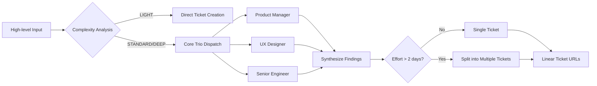

# RovoDev - AI-Powered Development Assistant

> 🚀 Transform high-level ideas into comprehensive Linear tickets with intelligent agent collaboration

RovoDev is a sophisticated development assistant that leverages specialized AI agents to automatically generate detailed project specifications, technical documentation, and implementation plans from simple descriptions.

## 🎯 Core Philosophy

**Pragmatic Startup Approach**:
- 🚀 **Ship Fast**: Focus on working solutions over perfect implementations
- 📊 **80/20 Rule**: Deliver 80% of the value with 20% of the effort
- 🎯 **MVP First**: Define the simplest thing that could possibly work

## 🏗️ Project Structure

```
rovodev/
├── agents/          # AI agent configurations and specifications
├── commands/        # Command documentation and templates
├── README.md        # This file
└── ...
```

## 🤖 Core Agent Team

RovoDev operates with a **Core Trio** of specialized agents that work in parallel to ensure comprehensive project analysis:

### 1. Product Manager Agent
- **Focus**: Defines the "Why" and "What"
- **Responsibilities**: User stories, business context, acceptance criteria
- **Outcome**: Clear business value and user-centric requirements

### 2. UX Designer Agent 👨‍🎨
- **Focus**: Defines the "How" for the user
- **Responsibilities**: User flow, states, accessibility, design consistency
- **Outcome**: Simple, accessible, and user-friendly interfaces
- **Location**: `agents/ux-designer.md`

### 3. Senior Software Engineer Agent
- **Focus**: Defines the "How" for the system
- **Responsibilities**: Technical approach, risks, dependencies, effort estimation
- **Outcome**: Scalable and maintainable technical solutions

## 🎫 Featured Commands

### linear-ticket

The flagship command that transforms high-level descriptions into comprehensive Linear tickets.

**Usage:**
```bash
linear-ticket <high-level description of work needed>
```

**Key Features:**
- ✨ **Smart Complexity Analysis**: Automatically determines if agents are needed
- 🔄 **Parallel Agent Execution**: Core Trio works simultaneously for efficiency
- 📋 **Comprehensive Ticket Generation**: Structured output with all necessary details
- ✂️ **Smart Ticket Scoping**: Auto-splits large work into manageable chunks (≤2 days each)

**Complexity Levels:**
- **LIGHT** (No agents): Simple fixes, typos, minor changes (<2 hours)
- **STANDARD** (Core Trio): New features, bug fixes, standard development work
- **DEEP** (Core Trio + Extended Analysis): Complex or vague requirements needing investigation

**Override Flags:**
- `--light`: Force minimal research (no agents)
- `--standard` / `--deep`: Force investigation depth
- `--single` / `--multi`: Control ticket splitting behavior

## 🛠️ Command Documentation

Detailed command specifications and usage examples are available in:
- `commands/command.md` - Complete command reference
- `commands/linear-ticket.txt` - Linear ticket command specifications

## 🚀 Quick Start

1. **Setup**: Ensure you have access to the agent configurations
2. **Basic Usage**: Run `linear-ticket "Create user authentication system"`
3. **Review Output**: Generated tickets will include:
   - Business context and purpose
   - Expected behavior/outcome
   - Research summary from all agents
   - Acceptance criteria
   - Dependencies and constraints
   - Implementation notes

## 📋 Ticket Generation Workflow



## 🎨 Agent Specifications

### UX Designer Agent Features
- **Product-minded approach**: Balances user needs with business goals
- **Accessibility focus**: Ensures inclusive design practices
- **Technical feasibility**: Considers implementation constraints
- **Rapid prototyping**: Emphasizes quick iteration and validation

## 🔄 Development Workflow

1. **Input**: Provide high-level feature description
2. **Analysis**: System determines complexity and required agents
3. **Parallel Execution**: Agents work simultaneously for efficiency
4. **Synthesis**: Findings combined into structured ticket(s)
5. **Output**: Linear ticket URLs with comprehensive specifications

## 📚 Documentation

- **Command Reference**: `commands/command.md`
- **Agent Configs**: `agents/` directory
- **Templates**: Available in command documentation

## 🤝 Contributing

RovoDev follows the pragmatic startup philosophy:
- Focus on working solutions first
- Iterate based on real user feedback
- Maintain high code quality without over-engineering
- Document decisions and trade-offs clearly

## 🏷️ Version & Updates

This project is actively maintained as part of the Vibe Codes Project ecosystem. Check commit history for latest updates and features.

---

**Built with ❤️ for efficient, intelligent development workflows**

*Part of the [Vibe Codes Project](https://github.com/triplex1/vibe_codes_proj) ecosystem*
